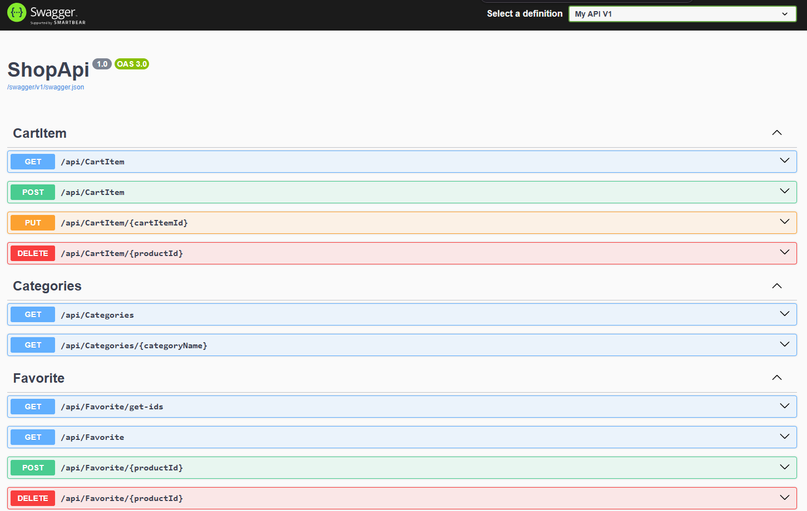

<div id="header" align="center">
  <h1>MLOGE Shop Api</h1>
</div>

***MLOGE Shop Api*** - это бэкенд сайта [MLOGE Shop](https://github.com/Androoomeda/ShopWebsite) c разработанным Api, через которое сайт получает информацию.

## Как это работает?

***MLOGE Api*** - это только бэкенд часть приложения, для полной демонстрации нужно включать [фронтенд](https://github.com/Androoomeda/ShopWebsite).

***ShopApi*** содержит контроллеры для обработки api запросов. Приложение подключено к `MS SQL` с помощью `EntityFramework Core`.
Для каждой сущности реализованы **CRUD** операции для работы с ними через api, данные которые возвращаются эндпоинтами всегда конвертируются в ***DTO***.

- Получение товаров, получение товаров конкретной категории, получение конкретного товара с доп. инфо-ей о нём;
- Регистрация/аутентификация c помощью с помощью **JWT** токена, хранимого в куки файлах и генерируемого c помощью библиотеки `JwtBearer`;
- Получение избранных товаров, удаление/добавление в избранное;
- Получение информации о пользователе, сколько у него товаров в избранном и корзине
- Получение товаров в корзине, добавление/удаление/изменение количетсва, расчёт итоговых сумм и скидки 

> [!NOTE]
> Неавторизованный пользователь ограничен в функционале сайта и поэтому может только смотреть товары, 
для покупки и добавления в избранного ему нужно зарегистрироваться.

Пример эндпоинта
```csharp
[HttpGet]
  [ProducesResponseType(200, Type = typeof(IEnumerable<ProductDto>))]
  public async Task<IActionResult> GetProducts()
  {
    var products = await _productRepository.Get();

    return Ok(products);
  }
```

## Swagger
Также для удобной работы и тестирования Api был подключен `Swagger`.


